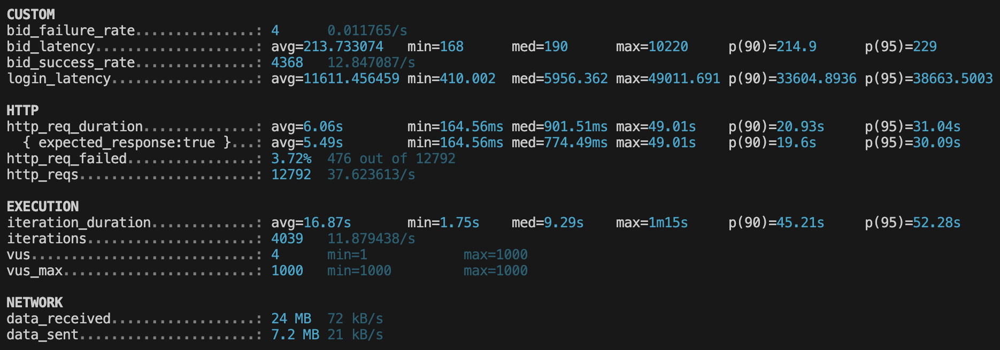
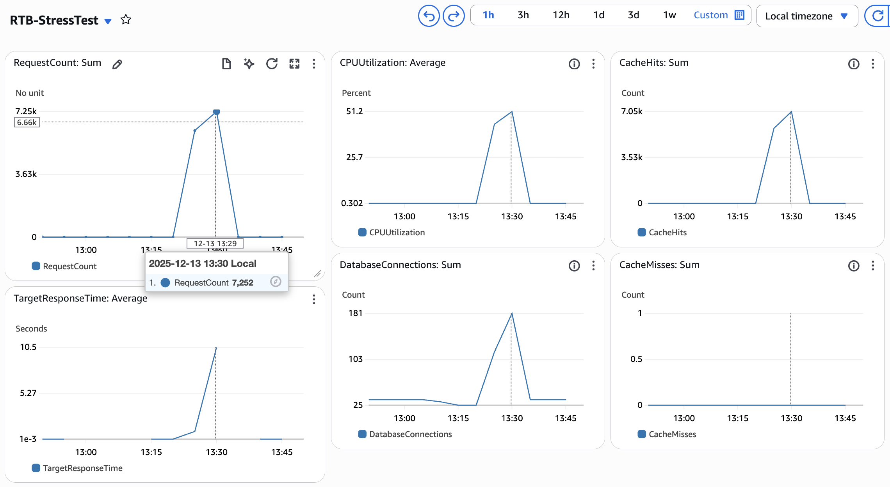
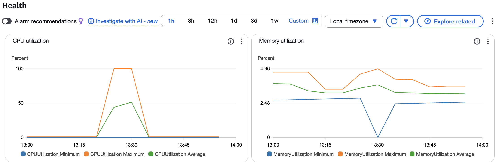

# Real-Time Bidding & Flash Sale System

# A. Project Summary

### **Objectives & Challenges**

The goal for the project is to design a cloud-based backend system capable of handling ***"Thundering Herd"*** traffic for a mixed **dynamic bidding** and **flash sale** e-commerce event.

The system was built to withstand **massive concurrency**, where thousands of users bid instantly, while adhering to strict requirements for **data consistency** (to prevent over-selling) and **high availability**. Additionally, the system meets the requirement for real-time leaderboard updates in sub-seconds.

### **Scoring Methodology**

To manage the bidding, the system implements a specific scoring formula:

$$
\text{Score} = \alpha \cdot P + \frac{\beta}{T+1} + \gamma \cdot W
$$

The parameters $P, T, W$ are configurable by the system administrator for individual products.

- $P$ (Price): The bid amount submitted by the user.
- $T$ (Time): The reaction speed of the user. (`bidTime - saleStartTime`)
- $W$ (Weight): The member weight or contribution level.

### Status & Key Performance Metrics

All 6 phases of the project as shown in `readme.md` have been completed. Stress testing verified the following performance statistics:

- **Throughput:** Achieved a **99% bid success rate** (4,368/4,372 successful bids) during "Thundering Herd" simulations with 1,000 concurrent users.
- **Reliability:** Auto-scaling reduced the request failure rate from 61% down to 4%.
- **Speed & Consistency:** Maintained sub-300ms bid latency at peak load with zero over-selling verified (orders did not exceed the maximum number of winners).

# B. System Architecture & Design

### High-Level Design

The system uses a cloud-native 3-tier architecture deployed on AWS, designed for high availability and horizontal scalability.

- **Client Layer:** Handles client-side interactions by establishing connections over HTTP/HTTPS and WSS for real-time communication.
- **Load Balancing:** An **AWS Application Load Balancer (ALB)** distributes incoming traffic to healthy containers. It manages SSL termination and uses "sticky sessions" to maintain persistent WebSocket connections.
- **Application Layer:** Hosted on **Amazon ECS Fargate**, running stateless Node.js containers that handle both REST API requests and Socket.IO real-time events. This layer auto-scales between 4 and 10 tasks based on CPU load.
- **Data & Cache Layer:**
    - **Amazon RDS (PostgreSQL 15.10):** Acts as the primary **persistent store**, managing user data, products, and final orders with ACID compliance.
    - **Amazon ElastiCache (Redis 7.0):** Provides high-performance caching and powers the real-time leaderboard using Sorted Sets (ZSET).

### Design Rationale

- **PostgreSQL vs. NoSQL:** PostgreSQL was selected to ensure strict data consistency and transactional integrity during the critical "order finalization" phase, which is essential for preventing inventory errors.
- **Redis for Leaderboards:** Redis Sorted Sets (ZSET) were chosen over SQL queries for ranking. This allows for sub-millisecond retrieval of the "Top K" winners and real-time rank calculation, which would be performance-prohibitive using standard database `ORDER BY` clauses under high concurrency.
- **Scoring Parameters:** The system uses a flexible parameter structure (global defaults overridden by product-specific settings) for the scoring formula ($\alpha, \beta, \gamma$). This allows administrators to fine-tune the dynamics of individual flash sales without deploying code changes.

### Consistency Models

- **Optimistic Locking (Redis):** During the active bidding phase, Redis acts as the gatekeeper, tracking tentative winners in real-time using atomic atomic operations.
- **Atomic Transactions:** When a sale is finalized, the system uses PostgreSQL transactions with row-level locking. It verifies that the count of orders never exceeds `max_winners` before committing, ensuring zero over-selling even if Redis and the database temporarily drift.

# C. Technical Specifications

### Tech Stack

- **Backend Runtime:** **Node.js** with Express was selected for its non-blocking I/O model, capable of managing thousands of concurrent WebSocket connections efficiently.
- **Database:** **PostgreSQL** serves as the source of truth, chosen for its ACID compliance to prevent over-selling and support for robust row-level locking.
- **In-Memory Store:** **Redis** is utilized for the real-time leaderboard (using Sorted Sets) and atomic operations to ensure sub-millisecond score updates.
- **Real-Time Transport:** Socket.IO provides the WebSocket layer with automatic fallback mechanisms and room-based broadcasting.

### Database Schema

- `users`: Stores account details and the `member_weight` used in scoring.
- `products`: Manages inventory with a `max_winners` field to define the cut-off.
- `bids`: Records every bid attempt with its `calculated_score`. It uses an `is_latest` boolean flag to quickly filter the user's active bid.
- `orders`: Stores the final confirmed winners.
- `scoring_parameters`: Holds the dynamic $\alpha, \beta, \gamma$ values, allowing per-product configuration overrides.

### Interface Definitions

- Examples of **RESTful API Endpoints**
    - `POST /auth/login`: Authenticate user and receive JWT token.
    - `POST /bids`: Submits a new bid.
    - `PUT /bids/:id`: Updates an existing bid with a higher price.
    - `POST /admin/products`: Creates a new product/sale event.
    - `GET /leaderboard/:product_id`: Returns a snapshot of the current Top K standings.
- **WebSocket Protocol**
    - `subscribe_leaderboard` (Client → Server): Subscribes a user to updates for a specific product.
    - `leaderboard_update` (Server → Client): Broadcasts the updated Top K list and threshold score.

# D. AWS Infrastructure & Deployment

### Infrastructure Configuration

The deployment utilizes **AWS ECS Fargate** for serverless container orchestration, configured with **1024 CPU units and 2048 MB memory** per task. A key architectural decision was using **Interface VPC Endpoints** for private connectivity to ECR and Secrets Manager, which eliminates the need for a public NAT Gateway and enhances network isolation.

### Security & Access Control

- **Secrets Management:** Database credentials and JWT secrets are never hardcoded; they are injected securely at runtime via **AWS Secrets Manager**.
- **Network Perimeter:** Security groups enforce strict ingress rules, allowing only Port 80 traffic from the internet to the Load Balancer, while restricting container traffic to internal Port 3000.

### Deployment & Operations

- **Deployment Automation:** The `deploy.sh` script automates the provisioning pipeline, including creating ECR repositories and pushing Docker images. A critical requirement is building images explicitly for the `linux/amd64` platform to ensure compatibility with Fargate.
- **Auto-Scaling Configuration:** The system employs a target tracking scaling policy based on **CPU utilization**. It automatically scales the task count between a minimum of 4 and a maximum of 10 tasks to maintain a target CPU usage of 70%, with a 60-second cooldown period for stability.
- **Monitoring:** Application and system logs are aggregated in **Amazon CloudWatch Logs** for troubleshooting and performance analysis.

# E. Testing Strategy & Performance Analysis

### Testing Methodology

The project employs **k6** to simulate the "Thundering Herd" phenomenon characteristic of flash sales. The test design replicates a "panic-buy" event by exponentially ramping up traffic in 1-minute intervals: **25 → 60 → 150 → 400 → 1000 concurrent users**. This progression, representing an approximate **2.5x growth factor per stage**, specifically tests the system's ability to handle massive viral growth.

### Performance Metrics

- **Throughput:** The volume of successful bid submissions (`bid_success_rate`) is tracked to measure the system's processing capacity during the sale window.
- **Latency:** Response times (`bid_latency`) are tracked to ensure the system remains responsive during peak traffic.
- **Error Rate:** The system monitors the ratio of failed requests (`http_req_failed`) to ensure reliability does not degrade significantly under stress.

### Test Results

- **Bid Success:** Achieved a **99.91% success rate**, processing 4,368 successful bids out of 4,372 attempts.
- **Latency:** Maintained a **p(95) bid latency of 229ms**, ensuring sub-second response times for bid processing.
- **Reliability:** The final error rate was recorded at **3.72%**, a significant improvement driven by auto-scaling which reduced errors from an initial 61.37% baseline.

▲ Screenshot of terminal after running stress test

▲ AWS CloudWatch dashboard during the stress test

▲ Monitoring utilization metrics of ECS tasks

# F. Demo

https://drive.google.com/drive/folders/1nYEOJGEWsR7wYdtVjgIwOaXZMEs1K2wE?usp=drive_link